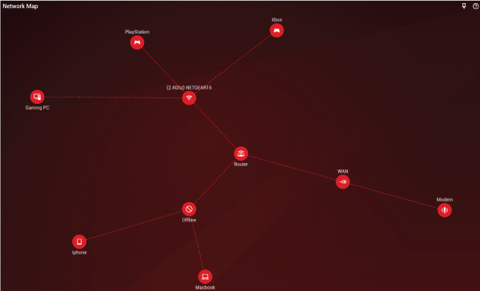
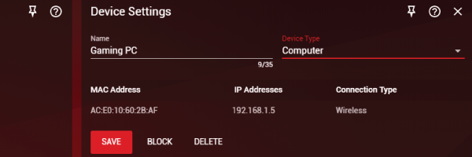

## Device Manager

The DumaOS Device Manager is designed to give you insight into how your network is set up. Whenever a new device connects you will see it appear on the Network Map panel under either the LAN or WiFi branch, and when it is disconnected the device will move to the 'Offline' branch. If you are using a router with dual-band WiFi, you will see your wireless devices appear under either the 2.4Ghz or 5Ghz branch.

To customise a device, first click on its icon to open the Device Settings panel.

In the Device Settings panel you can change the name of your device. You can also change its type should it have been misidentified. Ensure you click 'Save' after making any changes.

You can also 'Block' a device that you don't want connected to your network, or 'Delete' any devices that are offline and out of use for full control of your network set-up.