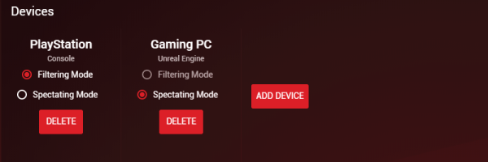
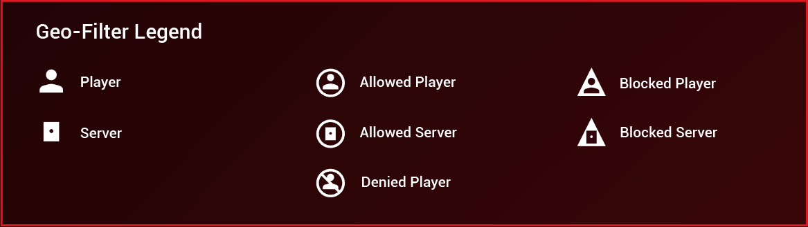
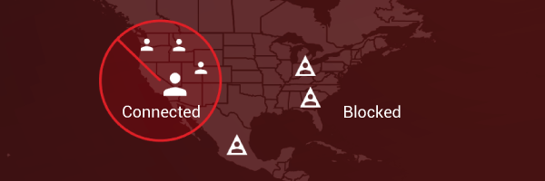
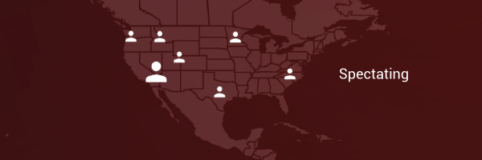
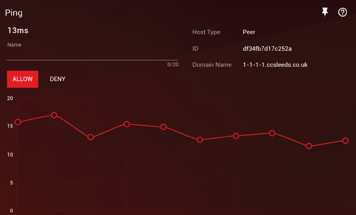

This guide will help you setup your DumaOS Geo-Filter to reduce lag in your favourite games. The Geo-Filter shows the location of the server you are playing on and its ping. When set to ‘Filtering Mode’, the Geo-Filter will guarantee the server is always located near your home, giving you the best possible connection.

Before following this guide, we recommend that you follow the Geo-Filter Tour within DumaOS, which can be started by clicking the ‘?’ icon at the top of the page. This will give you a basic understanding of how the Geo-Filter works. 

## Setup Steps

1. Turn off your game if it's currently running. It is not always essential to do this, but for a game like Black Ops 4 or Apex Legends, it is vital you make your Geo-Filter changes before booting up the game.

2. Click ‘**Add Device**’ on the Devices panel. Select your device from the list. If your selected device is a console, it will be added to the Geo-Filter upon clicking ‘Done’. If you have added a device that is not a console such as your gaming PC, you will be asked to select the game you wish to filter. Select the game from the dropdown list that appears. If your PC game is not listed, [see this guide](http://support.netduma.com/support/solutions/articles/16000092094-how-to-add-your-gaming-pc-to-the-dumaos-geo-filter).

    

    > NOTE FOR BLACK OPS 4 PC PLAYERS: you need to make a small adjustment for the Geo-FIlter to work Go to Device Manager and click on your gaming PC. Change the device type to a PS4 and click Save. Now go to the Geo-Filter and add your device at the top as described above. It will show the service as 'Console'. You can now follow the remaining steps

3. Once your device has been added it will default to either **Filtering Mode** or **Spectating Mode** depending on whether the service you have selected can be filtered. Filtering Mode will block connections outside of your radius. Spectating Mode will not block connections, it will just show where the locations are located.

    The reason we have two modes is that almost all console games and some PC games benefit from Filtering because you cannot choose the server within the game. But this is not true for every game, e.g. League of Legends, CS:GO, Battlefield etc, where you can choose the server. So for these games you just want Spectating Mode.

    

4. **Set your home location** on the map by clicking the ‘Pin-Drop’ icon located just above the Geo-Filter Map. Then click on your location on the Geo-Filter Map.

5. If you want to **zoom** in on your area of the Map, click the magnifying glass icon and then click on the Map. Click the X where the magnifying glass used to be to complete.

6. Expand the Geo-Filter Map options menu (click the three horizontal line icon in the top left of the Map) to change other settings. You can choose whether distance is in kilometres or miles. We recommend you keep **Strict Mode** on for every game except Destiny 2. We also recommend you keep Auto Ping Host enabled. If you want to learn more about these options, click the '?' icon in the corner of the Options menu.

7. Now **Set Distance** by dragging the distance slider. For a game that requires filtering, we recommend 1000km-2000km (600 miles - 1200 miles) to begin with. Once you start playing, you can move this up or down depending on your experience. For example, if search times are high, increase the size of the distance or if you feel search times are fast but your ping could be better, reduce the distance.

    > PING ASSIST: See this [separate guide](http://support.netduma.com/en/support/solutions/articles/16000087579--dumaos-optimal-settings-guide-ping-assist-step-2-1-) on how to optimally setup Ping Assist for your DumaOS-powered router

8. Now **boot up your game** and start searching. Refer to the legend below:

    

9. If you are in Filtering Mode, you will see hosts get blocked if they are outside of your radius. You will be blocking distant, higher-ping servers and hosts, allowing you to find the best online connections.

    

    If you are in Spectating Mode, hosts will not be blocked, but you can see their location. 

    

    > Note: if you see a server with a white ring around it (often in Ireland), this is just an Authentication Server used by the game to allow you to play. It's not a dedicated server that hosts your actual game. So you can ignore this when it appears.

10. View the **Ping** to the host in the panel that appears below the Map. If Auto Ping Host is enabled, it will do this automatically once the host has been chosen. If you disabled it in the Options menu on the Geo-Filter Map, then you need to click on a connection icon to view its ping. The largest icon will always be the host of the game.

    

## Allow and Deny

Allow lets you white-list your friends who live outside of your range so they can connect to you even if they are outside of your filter range. 

Deny lets you block connections that are within your range, for example a nearby server that gives you a bad connection. 

You 'Deny’ bad hosts or ‘Allow’ good hosts and friends from the Ping Panel on your Geo-Filter page.

## How to Deny a bad connection

1. If you have Auto Ping Host enabled, then the host of the game will be automatically pinged.
2. If you have Auto-Ping disabled, click on the icon you wish to deny on your Geo-Filter Map. The host is usually shown as the largest icon on your Geo-Filter Map. *(You can toggle Auto Ping Host on/off on the Geo-Filter Map's advanced options - click on the icon with the three horizontal lines in the top left corner of the panel to access this)*
3. In the Ping Panel below the Geo-Filter Map, name the connection and click on **Deny**. The connection will then be added to your Allow and Deny panel as denied
4. The connection will now be blocked whenever you next try to connect to it

## How to Allow a good connection / friend

1. To whitelist a friend or any other connection outside of your usual filter range, set your Filter to Spectating Mode in the top Device panel
2. Then connect to the person or server you want to whitelist. For example, invite your friend into your game lobby or party chat
3. The connection should then appear on your Geo-Filter Map. Click on the icon to load a ping graph for this connection. You will need to disable Auto Ping Host to be able to do this *(You can toggle Auto Ping Host on/off on the Geo-Filter Map's advanced options - click on the icon with the three horizontal lines in the top left corner of the panel to access this)*
4. In the Ping Panel below the Geo-Filter Map, name the connection and click on Allow. The connection will then be added to your Allow and Deny panel as Allowed
5. Set your Filter back to Filtering Mode in the top Device Panel
6. You will now always be able to connect to this allowed connection, even if they are outside of your filtering range

You have now successfully configured the Geo-Filter for gaming. [Click here for more Optimal Settings Guides](http://support.netduma.com/support/solutions/folders/16000090646)
