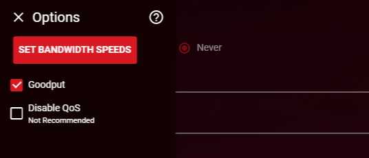
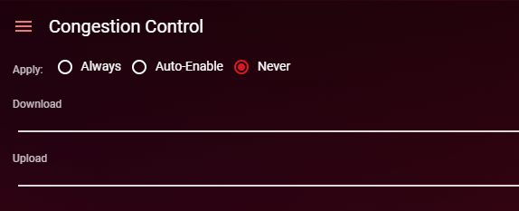
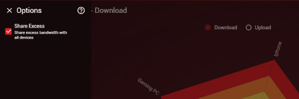
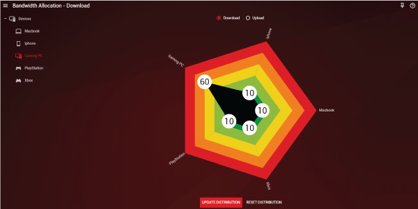
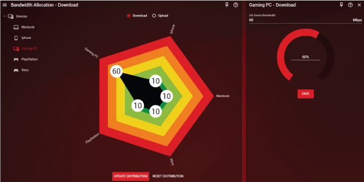
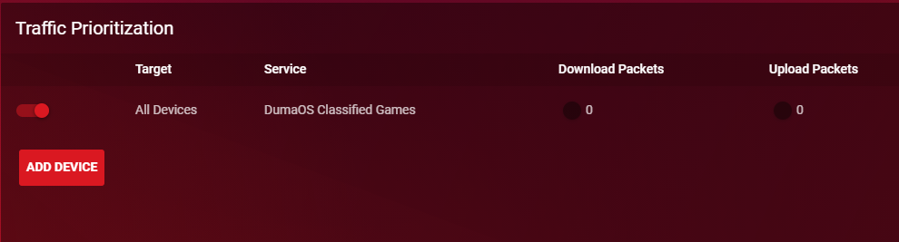
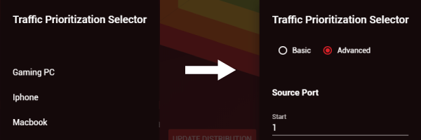

QoS stands for 'Quality of Service'. It is used to prevent congestion from building on your network, kind of like having a smart traffic controller during rush hour on the roads..

By default, the QoS R-App is configured to give you your full speeds provided by your ISP. However, this will not necessarily give you the best experience when gaming or doing anything else that is latency sensitive. This quick guide will help you setup your QoS optimal for gaming etc. If you just want to maximise your bandwidth speeds, check out our [DumaOS Speed Guide](/docs/dumaos-3/maximum-bandwidth-speeds/).

### Congestion Control

The Congestion Control feature is designed to prevent your game data from being impacted by someone downloading or uploading.

To configure Congestion Control for gaming, first open the Congestion Control submenu and input your expected speeds that your Internet Provider gives you. If you are not sure what these are, run a speedtest at [speedtest.net](http://speedtest.net)

Next, select 'Auto-enable' above the sliders. This option automatically enables Congestion Control only when you are playing an online game. If you have a very busy home network such as a smart home, we recommend selecting 'Always' instead.

Finally, set your Congestion Control  sliders to 70% Upload and 70% Download. This will prevent greedy devices from using more than 70% of your bandwidth, meaning there's always room for your gaming.

With this setup, whenever you play games your speeds will be throttled automatically and local congestion will be prevented. We recommend 70% as a good starting point and this should work well for all connection types, but feel free to move these up and down if you want to experiment.

### Bandwidth Allocation

Bandwidth Allocation allows you to prioritise devices in your home and choose how bandwidth is shared.

To ensure all connected devices are efficiently sharing bandwidth, enable ‘Share Excess’ in the Bandwidth Allocation submenu for both Download and Upload (it is enabled by default)

You can allocate bandwidth using the Bandwidth Flower. By dragging the sliders for each of your devices, you can choose how much bandwidth they are allowed to use. We recommend using the Bandwidth Flower to prioritise more bandwidth-heavy devices such as PC's, but make sure to give some bandwidth to your gaming devices.

Once you are happy with your layout. Click Update Distribution, otherwise your settings will not be saved.

To choose an exact amount of bandwidth to allocate, click on a device name from the list. This will open a new panel dedicated to that device, allowing you to type an exact number in Mbps to allocate. Click Save when complete to store your settings.

### Traffic Prioritisation

Traffic Prioritization automatically detects and prioritises game traffic, ensuring that local network queues cannot cause lag in your game. To enable this feature, make sure ‘DumaOS Classified Games’ is checked (which it is by default).

You can manually add ports to Traffic Prioritization. To do this, click ‘Add Device’ and select your device from the Traffic Prioritization Selector. Then, click ‘Next’, and select ‘Advanced’ at the top. On this page you can add individual ports (or ranges of ports) to Traffic Prioritization.

If you wish to add just one port, type its number into both the Start and End boxes beneath ‘Destination Port’. For a range of ports, type the first number of the range in Start and the last number of the range in End beneath ‘Destination Port’. After this, select your protocol and click ‘Done’.

You have now successfully configured QoS for gaming. [Click here for more Optimal Settings Guides](/docs/dumaos-3/).
