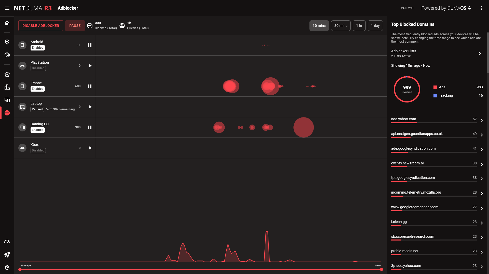

Adblocker protects your devices by blocking ads and trackers network-wide: even on hard-to-protect devices such as Smart TVs and games consoles.

## Customising Adblocker

Press Enable Adblocker to get started. You’ll immediately see that all your devices are now receiving the benefits of Adblocker, and any blocked traffic will appear as ‘bubbles’ to the right of each device.

The larger a bubble is, the more ads or trackers we blocked in a short space of time. You can select bubbles to see exactly what was blocked in that moment, and add blocked domains to your Allowlist which ensures they won’t get blocked again.

If you’re having trouble accessing a webpage, try pausing your device or all devices while you use it. Usually any issues can be solved by allowing the domain that’s being blocked incorrectly.

## Adding Custom Lists

To expand the capabilities of Adblocker, you can add your own domain lists for your router to block. You can find new lists of domains through online databases.

Navigate to your Adblocker Lists and press Add Blocklist to get started. You can provide a URL to a list, or create your own list manually.

> We suggest checking [firebog.net](https://firebog.net/) for new lists to add. Simply open the desired list in your browser and copy the URL. It should end in `.txt`

URLs can be added individually. You can add them with or without subdomains. You cannot however add specific paths.

✔ `www.microsoft.com`
✔ `microsoft.com`
❌ `https://www.microsoft.com`
❌ `microsoft.com/microsoft-teams`
