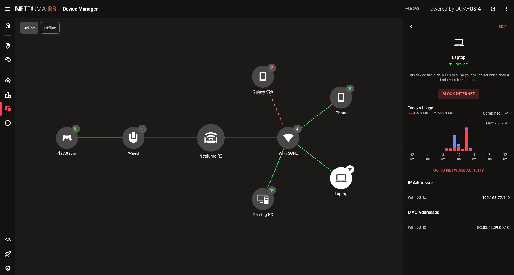

Device Manager lets you easily identify connected devices and manage their network access and interaction.

## Managing your network

Every device that connects to your network will appear in the list, ranked from Poor to Excellent based on its WiFi connection strength to your router. If the device is wired, it’ll always rank as Excellent. If any devices are getting a low rating, try bringing them closer to the router or using WiFi extenders to boost the signal.

## Customising devices

You can change your device type / name by selecting your device and pressing Edit. The easiest way to identify unnamed devices is to compare the IP addresses shown on Device Manager to what is shown in the settings of your devices.

Once you’ve found your device, try giving it a name and device type to make it easier to find in the future. Your device type is important when it comes to gaming, so make sure all your consoles and PC’s are using accurate details.
