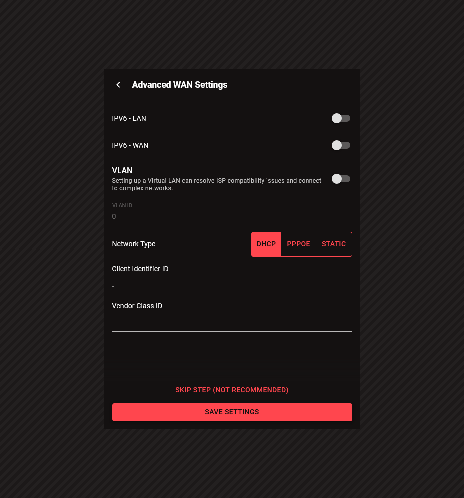
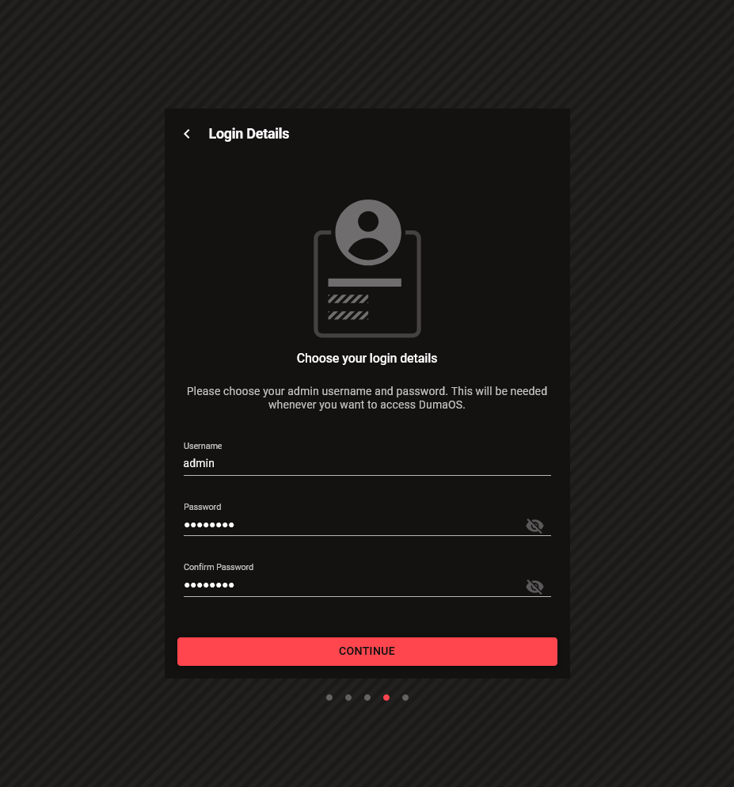
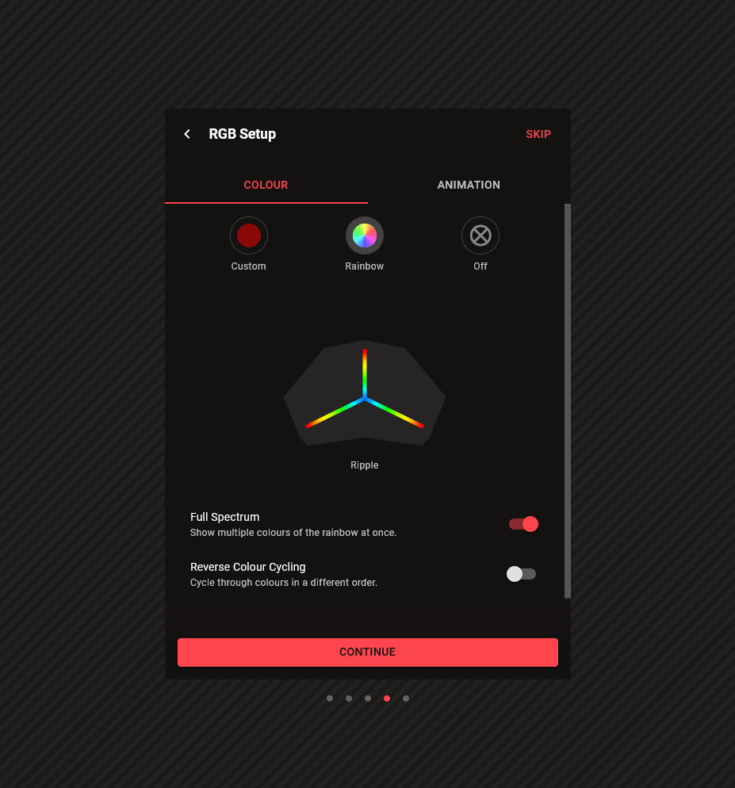

## Detecting Internet Connection

Once your Netduma router is connected via an Ethernet cable to your modem or upstream router, the internet connection can be detected automatically in most cases. If this step fails, see Advanced WAN Settings below, otherwise move straight to WiFi Details.

---

## Advanced WAN Settings

In some cases, you may need to configure Advanced WAN Settings. This may be necessary in the following scenarios:

- Your ISP requires IPv6

- Your ISP requires VLAN tags

- Your ISP requires PPPoE

Reach out directly to your internet service provider if you require these details.

---

## WiFi Details

On the next page, you'll decide on your WiFi details. These will be pre-set to the default WiFi credentials, which are written on the sticker on the bottom of your Netduma router. R3 users can also look at the WiFi Details card which came packaged with their router.

If you are setting up your router via WiFi, you will have to connect to the new credentials after this step is complete. If you ever forget your WiFi credentials, you will be able to check and update them via a wired connection later.

---

## Login Details

Create login details for your Netduma router. These details will be required every time you want to access the frontend. These are different from your WiFi Credentials. If you later forget these details, you will have to factory reset your unit to regain access. This can be done by holding the recessed Reset button on the back.

---

## Speed Test

In order to allocate your bandwidth to the activities you care about, DumaOS needs to know your maximum bandwidth speed. We can perform a speed test to figure it out automatically, or you can enter it manually if you already know.

It is important that this is set accurately for Ping Optimiser to function correctly.

---

## Choosing Your Priorities

In this step, you choose the network activities which are important to you. When these activities are detected, they will be prioritised above other traffic.

Our suggested selection is Gaming, Video & Streaming and Work From Home.

**Please note:** If you select too many Priorities, this will reduce DumaOS's effectiveness. We suggest that you do not select bandwidth-heavy activities such as File Sharing, as this will damage the experience for other categories.

---

## Ping Optimiser

Ping Optimiser tests your network under load, and finds the settings that will reduce your ping by the greatest amount. The test will take a couple of minutes, and your results will show the reduction in ping that was achieved by DumaOS.

The "Old Ping" represents the in-game ping you would have had without DumaOS during network congestion. The "New Ping" represents the ping that you will have during congestion now that DumaOS is prioritising your gaming activity.

**Please note:** The ping reduction will apply to all prioritised activities, but will be most perceptible in gaming.

---

## RGB Setup (R3 Only)

On the Netduma R3, you can customise the RGB lights on the top of the router. You can select from various patterns and colours. Experiment to find one you like!

Also, you can choose "Reactive Lighting". This will display a unique colour pattern on your router when Gaming traffic is detected.

---

## Your Preferences

These are some additional settings you may wish to change before finalising your setup.

- **Use System Theme** - The Light/Dark mode selected on your Operating System or Browser will be used in DumaOS.

- **Theme** - A specific theme can be selected for DumaOS, ignoring your system theme.

- **Adblocker** - DumaOS's Adblocker feature will block Ads and Tracking across your whole network.

- **Telemetry** - Information on errors and feature usage will be collected in anonymised form by Netduma for product improvement. Opt out here.

- **Home Location** - Used by Geo-Filter to help you find game servers close to your home. Can be set later.

---

Now that you've completed the Setup Wizard, take a look at our feature guides to take full advantage of your Netduma router!
