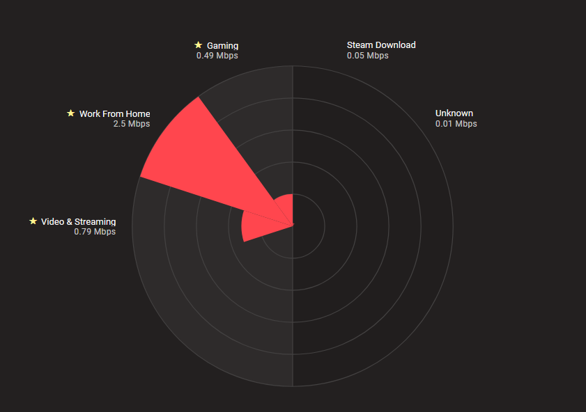
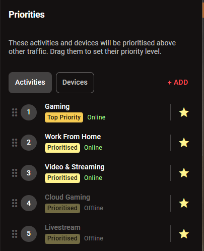
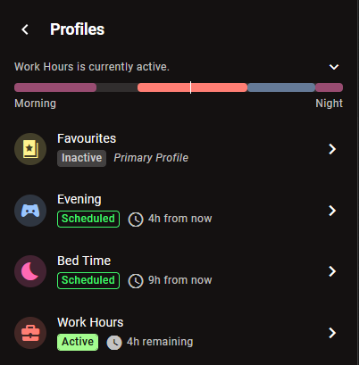
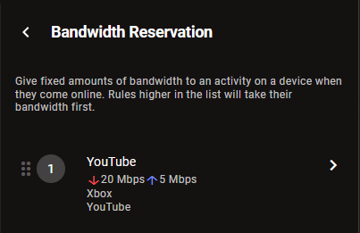

SmartBOOST dynamically adjusts to give your favourite applications the exact bandwidth they need to perform at their best. By deeply understanding and catering for the requirements of almost all popular apps, SmartBOOST is the next generation of router QoS.

Add some priorities to get started. You can prioritise devices, applications, or whole categories of applications.

## Fine-tuning SmartBOOST

Once you’ve prioritised some items, you can order them based on what matters to you - from most important to least. When bandwidth is being used, SmartBOOST will ensure that your favourites will always get what they need based on your priority order.

Devices are prioritised in a separate list, with their own order of importance. Applications in use on your favourite devices will be given a higher priority than those on other devices.

## Understanding allocation

SmartBOOST makes decisions over ten times per second, constantly striving for the perfect allocation of bandwidth across your favourite devices and apps.

On the chart, you can see all of your priorities in the left hemisphere, while the right half displays other activities on your network. Regardless of what’s being used on the right, all of your priorities on the left will be well looked after.

To get a very in-depth breakdown of exactly how bandwidth is being allocated on your network, access Stats For Nerds in the context menu.

## Creating Profiles

Profiles let you swap out your active priority list on a schedule. Try scheduling in your work hours or other routine events to fully automate your network. Don’t worry - even without custom profiles, we’ll still make sure your priorities get what they need.

## Bandwidth Reservation

Using Bandwidth Reservation, you can give a chosen application on a chosen device a guaranteed minimum slice of your bandwidth.

While SmartBOOST will always try to balance your connection, Bandwidth Reservation allows you to manually assign larger amounts of bandwidth than might be allocated by the default settings. It also acts as a guarantee that bandwidth will not drop below the set threshold.

