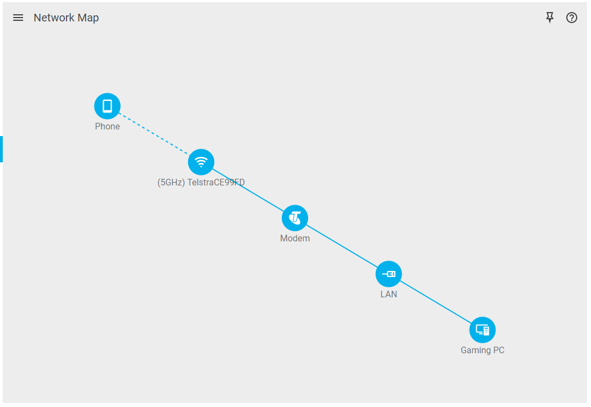

# Device Manager

## Network Map

The Network Map displays your connected devices, how they are connected and which devices are currently offline in a simple tree.

Alternatively, enable Table Mode to view your network in more detail. This can be found in the Network Map submenu.

Click on a device to access its settings.

## Device Settings

A) Rename the device by typing a new name into the Name text box.
B) Select which type of device it is using the Device Type drop-down menu.
C) Click Save to save your changes.
D) Click Block to prevent an unwanted device from accessing your network.
E) Click Delete to remove an offline device from your Device Tree.

