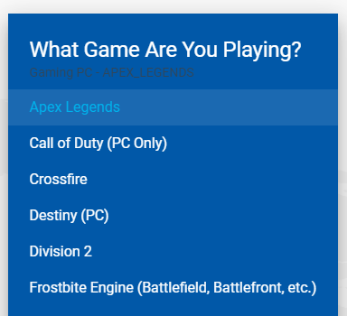
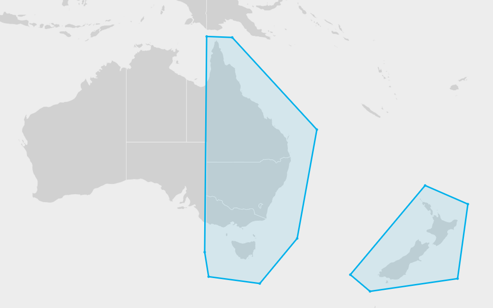
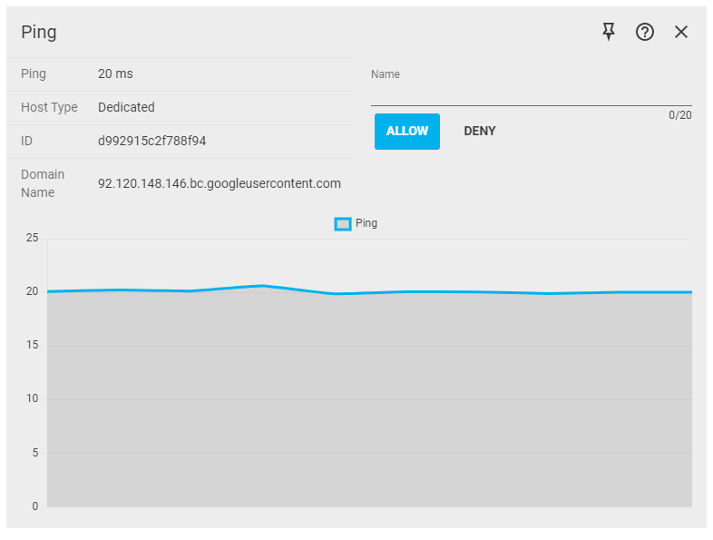

Lag in online games is usually caused by the distance from you to the host or server of your game. Geo-Filter allows you to specify which areas of the world you wish to connect to, meaning you can stop connections to laggy hosts before they happen.

The effect on your game should be improved response time and fairer gameplay.

## Getting Started

Turn off your game if it's currently running. It is not always essential to do this, but for a game like Call Of Duty or Apex Legends, it is vital you make your Geo-Filter changes before booting up the game.

Click Add Device and select your device. If your device is not listed, make sure it is connected to the Smart Modem. Select the game you will be playing. Geo-Filter will tell you whether Filtering Mode is suggested for your chosen game.

The reason we have two modes is that almost all console games and some PC games benefit from Filtering because you cannot choose the server within the game. But this is not true for every game, e.g. League of Legends, CS:GO, Battlefield etc, where you can choose the server. So for these games you just want Spectating Mode.

## Set Your Home

A) Click on the Home Pin icon.

B) Click on where you are located on the map.

C) The radius blocks all hosts outside its range. Set the size using the Distance slider.

## Polygon Mode

A) Alternatively, you can draw filter shapes on the map by enabling Polygon Mode.

B) Click the Pencil icon to draw shapes

C) Click the Delete icon to remove shapes.

<!-- markdownlint-disable-next-line MD036 -->
*Start Gaming*

Blocked connections outside of your radius will appear as warning triangles. Take a look at the Geo-Filter legend in the top right hand corner of the Geo-Filter to confirm what icons mean.

## Ping Graph

Ping shows the connection quality (latency) from you to the connection you have selected on the map. This is measured in milliseconds.

With Auto Ping Host enabled in the Geo-filter submenu, you can automatically ping your game's host and unlock advanced connection statistics like Tickrate.

A ping of <50ms is considered to be good for gaming online.

## Allow and Deny

### How to Deny a bad connection*

If you have Auto Ping Host enabled, then the host of the game will be automatically pinged.

If you have Auto-Ping disabled, click on the icon you wish to deny on your Geo-Filter Map. The host is usually shown as the largest icon on your Geo-Filter Map. (You can toggle Auto Ping Host on/off on the Geo-Filter Map's advanced options - click on the icon with the three horizontal lines in the top left corner of the panel to access this)

In the Ping Panel below the Geo-Filter Map, name the connection and click on Deny. The connection will then be added to your Allow and Deny panel as denied

The connection will now be blocked whenever you next try to connect to it

### How to Allow a good connection / friend

To whitelist a friend or any other connection outside of your usual filter range, set your Filter to Spectating Mode in the top Device panel

Then connect to the person or server you want to whitelist. For example, invite your friend into your game lobby or party chat

The connection should then appear on your Geo-Filter Map. Click on the icon to load a ping graph for this connection. You will need to disable Auto Ping Host to be able to do this (You can toggle Auto Ping Host on/off on the Geo-Filter Map's advanced options - click on the icon with the three horizontal lines in the top left corner of the panel to access this)

In the Ping Panel below the Geo-Filter Map, name the connection and click on Allow. The connection will then be added to your Allow and Deny panel as Allowed

Set your Filter back to Filtering Mode in the top Device Panel

You will now always be able to connect to this allowed connection, even if they are outside of your filtering range
