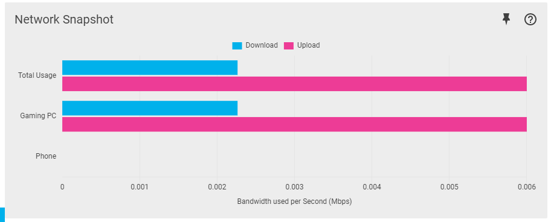

## Analyse Network Usage

The Network Monitor helps you to identify who, or what, is using your network thanks to enterprise level Deep Packet Inspection (DPI).

You can then use this information to apply the best QoS settings.

## Network Snapshot

Network Snapshot shows the bandwidth being used by all of your devices, and is measured in megabits per second (Mbps).

Clicking on a bar will open the Category Breakdown. Clicking on a segment will open the Application Breakdown.

## Network Overview

The Network Overview shows your network’s current, total bandwidth usage. This graph is measured in megabits per second (Mbps).

