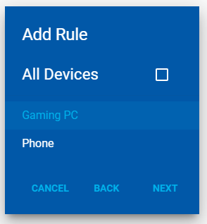
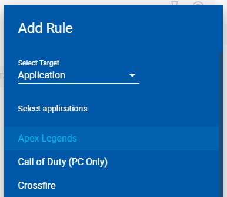

# Traffic Controller on Telstra Game Optimiser

## Next-generation Firewall

Traffic Controller blocks traffic by device or application, on a schedule.

Making Rules lets you manage every aspect of your home network, from freezing your kids Internet to preventing security risks to your IoT devices.

### Create Rule

1. Click Add Rule to get started. Select the type of rule you are creating and the target(s) for it.

2. Select the hours and days you want the rule to apply for, and click Done.

## Rule Table

Created rules are ordered by priority, and can be reordered using the Drag Handle. Each rule can be edited, deleted and turned on or off.

Toggle Track to see when a rule is triggered on the Event Capture panel.

