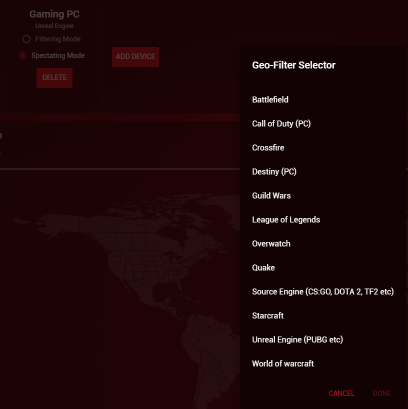
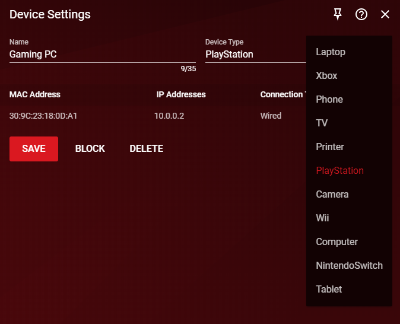
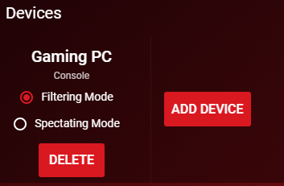


  This guide was written for DumaOS 3 devices, and may not be applicable to DumaOS 4.


This is a specific guide on how to add your Gaming PC to your Geo-Filter. A full optimal settings guide for the Geo-Filter can be found [here](/docs/dumaos-3/geo-filter/). 

## How to Add your Gaming PC to the Geo-Filter

1. Click ‘**Add Device**’ on the Devices panel. Select your Gaming PC from the list. 

    

2. Select the game game engine you are playing on your PC and click Done. If your game isn't listed here, keep reading this guide below for further steps:

    

## How to add a PC game not listed on the Geo-Filter

1. Go to the Device Manager.

2. Click on your Gaming PC.

3. In the new panel that opens, change the device type to a PlayStation.

    

4. Go to the Geo-Filter.

5. Delete your PC from the top Geo-Filter panel if you have added it previously.

6. Now add your PC. It should automatically be added with the 'console' service.

    

7. Decide if you want to use Filtering Mode or Spectating Mode (see our [Geo-Filter guide](/docs/dumaos-3/geo-filter/) if unsure)

Your Geo-Filter will now show your PC game(s) server when you next play. To setup your Geo-Filter optimally, please see this [guide](/docs/dumaos-3/geo-filter/)
