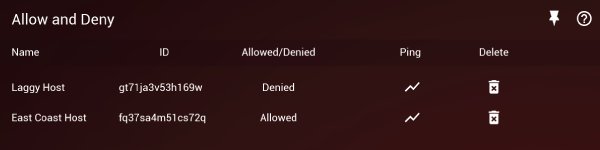


  This guide was written for DumaOS 3 devices, and may not be applicable to DumaOS 4.


**Allow** lets you white-list your friends who live outside of your range so they can connect to you even if they are outside of your filter range. 

**Deny** lets you block connections that are within your range, for example a nearby server that gives you a bad connection. 

You 'Deny’ bad hosts or ‘Allow’ good hosts and friends from the Ping Panel on your Geo-Filter page.

### How to Deny a bad connection

1. If you have Auto Ping Host enabled, then the host of the game will be automatically pinged.
2. If you have Auto-Ping disabled, click on the icon you wish to deny on your Geo-Filter Map. The host is usually shown as the largest icon on your Geo-Filter Map. *(You can toggle Auto Ping Host on/off on the Geo-Filter Map's advanced options - click on the icon with the three horizontal lines in the top left corner of the panel to access this)*
3. In the Ping Panel below the Geo-Filter Map, name the connection and click on **Deny**. The connection will then be added to your Allow and Deny panel as denied
4. The connection will now be blocked whenever you next try to connect to it

### How to Allow a good connection / friend

1. To whitelist a friend or any other connection outside of your usual filter range, set your Filter to Spectating Mode in the top Device panel
2. Then connect to the person or server you want to whitelist. For example, invite your friend into your game lobby or party chat
3. The connection should then appear on your Geo-Filter Map. Click on the icon to load a ping graph for this connection. You will need to disable Auto Ping Host to be able to do this *(You can toggle Auto Ping Host on/off on the Geo-Filter Map's advanced options - click on the icon with the three horizontal lines in the top left corner of the panel to access this)*
4. In the Ping Panel below the Geo-Filter Map, name the connection and click on Allow. The connection will then be added to your Allow and Deny panel as Allowed
5. Set your Filter back to Filtering Mode in the top Device Panel
6. You will now always be able to connect to this allowed connection, even if they are outside of your filtering range

You have now successfully configured the Geo-Filter for gaming. [Click here for more Optimal Settings Guides](/docs/dumaos-3/)
