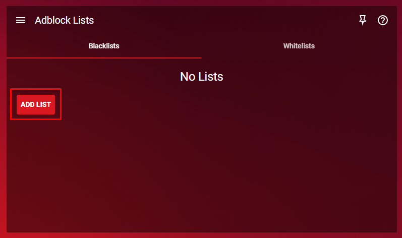
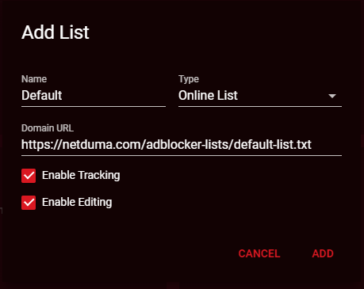
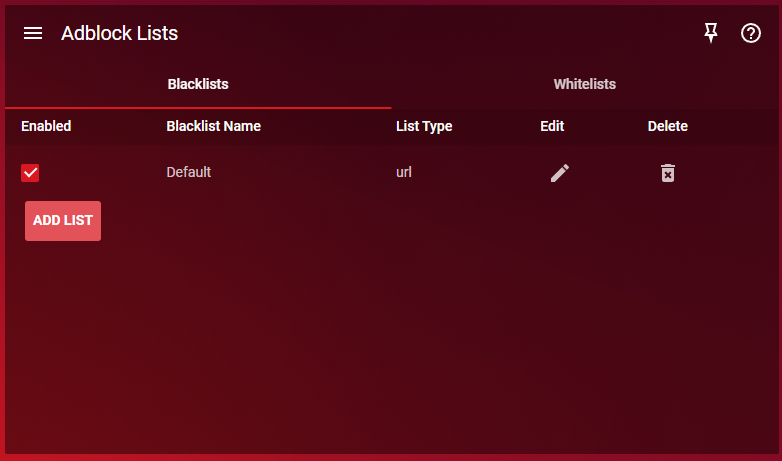
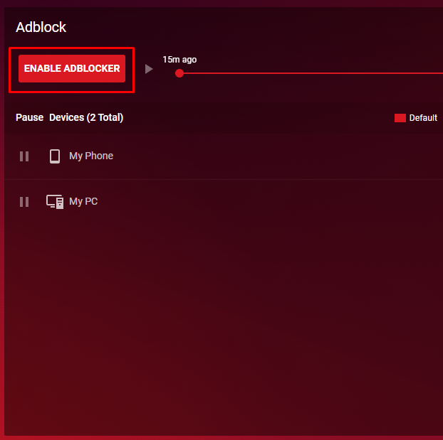

XR1000 users on firmware version 1.0.0.64 may find that they have no default lists in Adblocker.

However, you can manually add the default list by following the instructions below:

- Open Adblocker on DumaOS

- Navigate to the Adblock Lists panel and choose ADD LIST

- Enter the name as Default, and paste in the following URL: https://netduma.com/adblocker-lists/default-list.txt!

After clicking ADD, you should now have a Default list

- Now scroll up to the main Adblock panel, and click ENABLE ADBLOCKER

Ads should now be blocked across your entire home network!
