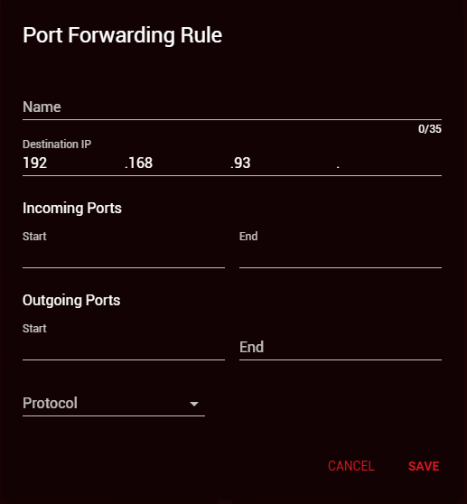

Port forwarding is a great way to achieve an open NAT type for multiplayer games. It is recommended in most cases that UPnP is used instead of port forwarding, since it can detect which ports need to be opened and handles port forwarding automatically. If UPnP does not secure you an open NAT, you should disable UPnP and try port forwarding.

To access the Port Forwarding menu, first click on 'Network Settings' and then select 'Port Forwarding' on the LAN settings panel.

Next, click 'Add Rule'. This will open the port forwarding box seen below:

In the 'Name' text box, type any name you want to help identify your port forwarding rule. (e.g Call of Duty Ports)

Next, in 'Destination IP', type the last remaining digits of the IP address you are entering a rule for. (e.g If you are forwarding ports on your gaming console, find out the console IP address on the Device Manager before entering that number here).

Now it's time to enter which ports you are forwarding. Remember that you may need to create multiple port forwarding rules depending on which game or service you are using.

When you're forwarding ports, you should use the same values for both 'Incoming Ports' and 'Outgoing Ports' in almost all cases.

Start Port - If the ports you need to open are in a range (e.g. 1 - 10) you would type the first port in that range here. If you need for open only one port, this number should be the same as ‘End Port’.

End Port - If the ports you need to open are in a range you would type the last port in that range here. If you only need to open one port, this number should be the same as ‘Start Port’.

Protocol - You can choose between TCP, UDP or both. You should be able to find out which option you need to select here online.

---

## **<u>Still not able to achieve an open NAT?</u>**

If you have tried every step in this guide and still cannot get an open NAT, check out the [DumaOS NAT guide](/docs/dumaos-3/open-nat/).
