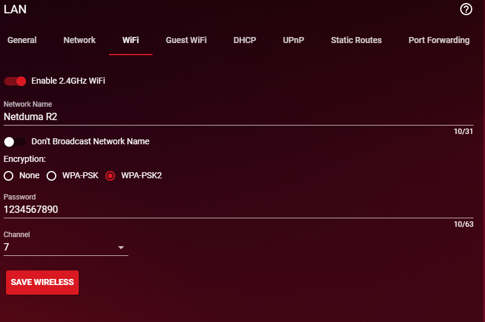

**If you've forgotten the password to your WiFi, please follow the below steps:**

1. Connect to your R2 via **ethernet** using the cable supplied in the box
2. In your web browser, navigate to ***192.168.77.1***
3. Login using the default credentials found in the bottom left corner of the sticker on the underside of the R2
   - These are typically ***admin*** and ***password***
4. Now you’re in the R2 interface, go to ***Network** settings* and then ***WiFi***
   
5. Change the password and click ***Save Wireless***