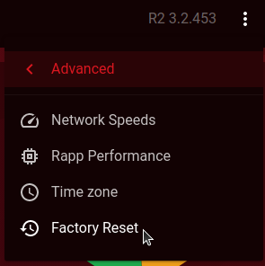

This guide details how to upgrade the firmware on your Netduma R2.

First thing's first, make sure you've got your firmware to hand or download the latest from here:

[DumaOS Firmware : NETDUMA](https://support.netduma.com/support/solutions/articles/16000091217-latest-firmwares)

Now, access the DumaOS interface by opening a web browser on a device connected directly to your R2 and entering **dumaos/** or **192.168.77.1** in the URL bar.

Here, login and click the three-dot menu in the top right and select "Update".

Browse for your firmware file and upload it to the R2.

Allow the R2 some time to update, this can take up to two minutes.

Once complete, we would always suggest factory resetting the R2 afterwards.
You can do this by going to the same three-dot menu -> Advanced -> Factory Reset.

Please remember that after factory resetting the R2, you will then need to access the DumaOS interface again and complete the setup wizard.
